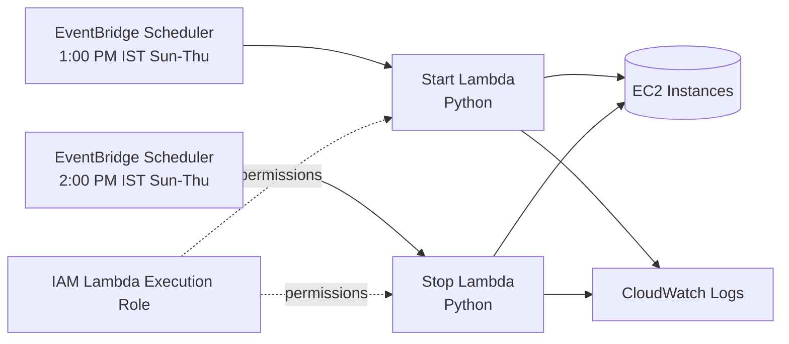

# AWS EC2 Start/Stop Cost Optimization

Automated EC2 cost optimization using **AWS Lambda, Python, EventBridge Scheduler, IAM, and CloudWatch**.

## Project Overview

This project automatically starts and stops selected Amazon EC2 instances according to a defined schedule. Instances are identified by a tag, so the automation does not depend on hard-coded instance IDs.

The current lab schedule is:

| Action | Time | Days | Time zone |
|---|---|---|---|
| Start EC2 | 1:00 PM | Sunday–Thursday | Asia/Kolkata (IST) |
| Stop EC2 | 2:00 PM | Sunday–Thursday | Asia/Kolkata (IST) |

> The schedule is configured in EventBridge Scheduler. Change it before using this pattern in another environment.

## Architecture



A standalone architecture diagram is also provided as `architecture/architecture.svg`.

## AWS Services

- **Amazon EC2** — compute instances being managed.
- **AWS Lambda** — executes Python automation without managing servers.
- **Amazon EventBridge Scheduler** — invokes the Lambda functions at scheduled times and supports an explicit time zone.
- **AWS IAM** — provides least-privilege permissions to the Lambda execution role and invocation permissions for Scheduler.
- **Amazon CloudWatch Logs** — stores Lambda execution logs for troubleshooting and auditing.

## How It Works

1. An EC2 instance is tagged as eligible for automation.
2. EventBridge Scheduler invokes the start or stop Lambda.
3. Lambda calls the EC2 API through `boto3`.
4. Lambda discovers matching instances using tags rather than fixed instance IDs.
5. The function starts stopped instances or stops running instances as appropriate.
6. Execution details are written to CloudWatch Logs.

### Tag-based targeting

The code uses environment variables so the tag can be changed without modifying the Lambda source:

```text
TAG_KEY=cost optimization
TAG_VALUE=auto start/stop
```

If your AWS tag uses different spelling/capitalization, update the Lambda environment variables to match it exactly.

## Repository Structure

```text
AWS-EC2-start-stop-Cost-Optimization/
├── architecture/
│   └── architecture.svg
├── docs/
│   ├── deployment-guide.md
│   ├── testing.md
│   └── troubleshooting.md
├── iam/
│   ├── lambda-trust-policy.json
│   └── ec2-start-stop-policy.json
├── lambda/
│   ├── start_ec2/
│   │   └── lambda_function.py
│   └── stop_ec2/
│       └── lambda_function.py
├── tests/
│   └── test-cases.md
├── .gitignore
├── LICENSE
└── README.md
```

## IAM Design

The Lambda execution role requires only the EC2 read/start/stop operations needed by the automation, plus CloudWatch Logs permissions.

Core EC2 permissions:

```text
ec2:DescribeInstances
ec2:StartInstances
ec2:StopInstances
```

`DescribeInstances` is required because the functions discover target instances by tag before attempting a state change.

## Security Considerations

- Do not put AWS access keys or secrets in Lambda code.
- Use an IAM execution role for Lambda.
- Restrict EC2 permissions to only the API actions required by the application.
- Prefer tag-based resource controls and separate production/non-production automation.
- Review CloudWatch logs for unexpected actions.
- Test with a non-production instance before applying the automation broadly.

## Cost Optimization Logic

The value of the project comes from removing unnecessary EC2 running time. For workloads that are only needed during defined working hours, stopping instances outside those hours reduces compute usage.

Example calculation:

```text
24 hours/day - 1 hour/day used in this lab = 23 hours/day not running
```

For an actual cost estimate, use the hourly price of the instance type and region, then compare scheduled runtime with 24/7 runtime. Do not claim a specific dollar saving without using the actual EC2 pricing for the deployment.

## Deployment

See [`docs/deployment-guide.md`](docs/deployment-guide.md) for the AWS console setup and validation process.

## Testing

See [`docs/testing.md`](docs/testing.md) for positive and negative test cases.

## Troubleshooting

See [`docs/troubleshooting.md`](docs/troubleshooting.md). A common failure is missing `ec2:DescribeInstances` permission; the Lambda cannot discover tagged instances without it.

## Resume Description

> Developed a serverless AWS EC2 cost-optimization automation using Python and AWS Lambda to start and stop tagged EC2 instances on predefined schedules. Configured EventBridge Scheduler with IST-based schedules and implemented IAM-controlled EC2 permissions with CloudWatch logging for operational visibility.

## Disclaimer

This is a portfolio/lab implementation. Review permissions, schedules, tagging conventions, and failure handling before using it in a production environment.
