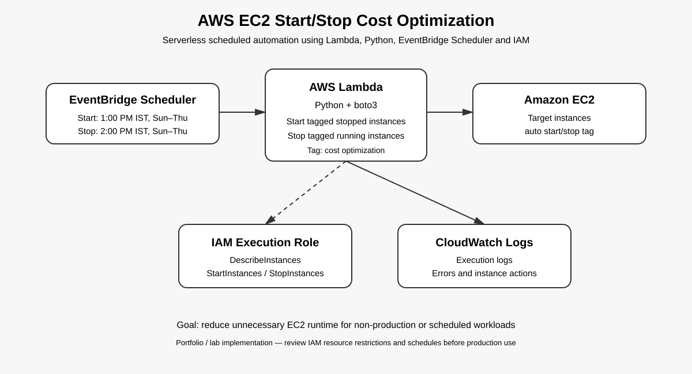

# AWS EC2 Start/Stop Cost Optimization

> Serverless EC2 scheduling automation that reduces unnecessary compute runtime using **AWS Lambda, Python, EventBridge Scheduler, IAM, and CloudWatch**.

[](https://github.com/sumair-design/AWS-EC2-start-stop-Cost-Optimization/actions/workflows/ci.yml)

## Problem

Development and test EC2 instances are often left running outside working hours. That creates avoidable compute spend and requires engineers to remember manual start/stop operations.

## Solution

This project implements a tag-driven, serverless automation pattern:

```text
EventBridge Scheduler
        |
        +----> Start Lambda ----+
        |                        |
        |                        v
        |                    Amazon EC2
        |                        ^
        |                        |
        +----> Stop Lambda ------+
                 |
                 v
          CloudWatch Logs

        IAM controls both Lambdas
```

The Lambda functions discover instances by tag instead of hard-coding instance IDs. This makes the automation reusable across multiple instances.

## Portfolio Snapshot

| Area | Implementation |
|---|---|
| Compute | Amazon EC2 |
| Automation | AWS Lambda + Python/boto3 |
| Scheduling | EventBridge Scheduler |
| Identity | IAM execution roles and least-privilege actions |
| Observability | CloudWatch Logs |
| Target selection | EC2 tags |
| Testing | pytest + mocked AWS API calls |
| CI | GitHub Actions |

## Current Lab Configuration

The deployed lab shown in the evidence screenshots uses:

| Action | Time | Days | Time zone |
|---|---:|---|---|
| Start | 1:00 PM | Sunday–Thursday | Asia/Kolkata (IST) |
| Stop | 2:00 PM | Sunday–Thursday | Asia/Kolkata (IST) |

**Important:** these values are lab configuration, not universal production recommendations. Change the schedule for the workload's actual operating hours.

## Architecture



### Request flow

1. EventBridge Scheduler reaches the configured schedule.
2. Scheduler invokes the appropriate Lambda function.
3. Lambda calls EC2 through the AWS SDK for Python (`boto3`).
4. EC2 instances are selected using `TAG_KEY` and `TAG_VALUE` plus the desired instance state.
5. The function submits a start or stop request for all matching instances.
6. Lambda logs discovery results and action results to CloudWatch Logs.

## Tag-Based Targeting

The automation uses environment variables rather than embedding infrastructure identifiers in source code:

```text
TAG_KEY=cost optimization
TAG_VALUE=auto start/stop
```

Example EC2 tag:

```text
Key:   cost optimization
Value: auto start/stop
```

This design lets an operator add or remove an instance from the automation scope without editing Lambda code.

## IAM Design

The Lambda role needs:

- `ec2:DescribeInstances` — discover matching instances.
- `ec2:StartInstances` — start matching stopped instances.
- `ec2:StopInstances` — stop matching running instances.
- CloudWatch Logs permissions — write execution logs.

The repository's IAM policy restricts start/stop operations using the EC2 resource tag condition. `DescribeInstances` remains resource-wide because EC2 describe APIs do not support the same instance-level resource restriction.

The Lambda trust policy allows the Lambda service to assume the execution role.

See:

- `iam/lambda-trust-policy.json`
- `iam/ec2-start-stop-policy.json`

## Lambda Implementation

Both functions follow the same pattern:

- read tag configuration from environment variables;
- paginate `DescribeInstances` results;
- filter by the expected EC2 state;
- avoid unnecessary API calls when there are no matches;
- log useful operational context;
- surface AWS API failures instead of silently hiding them.

### Start function

`lambda/start_ec2/lambda_function.py` finds tagged **stopped** instances and calls `StartInstances`.

### Stop function

`lambda/stop_ec2/lambda_function.py` finds tagged **running** instances and calls `StopInstances`.

## Cost Optimization Model

Stopping an EC2 instance removes its normal instance compute runtime while it is stopped, although attached resources such as EBS volumes can continue to incur charges.

For a simple estimate:

```text
Potential compute-hours avoided
= number of eligible instances × hours stopped
```

```text
Approximate compute savings
= avoided compute-hours × applicable EC2 hourly rate
```

Do **not** claim a fixed percentage or dollar saving without using the actual instance type, region, pricing model, and operating schedule.

## Reliability & Safety

The project intentionally avoids blind start/stop calls:

- Start only searches for instances currently in `stopped` state.
- Stop only searches for instances currently in `running` state.
- No matching instances results in a successful no-op.
- AWS API errors are logged and re-raised so failures are visible.
- Pagination prevents the implementation from silently ignoring additional matching instances.

For production, consider adding retry/backoff, concurrency controls, alerting, and an explicit exclusion tag for protected workloads.

## Testing

The repository contains unit tests for the Lambda behavior and a GitHub Actions workflow that compiles the Python source and runs pytest.

Run locally:

```bash
python -m pip install -r requirements-dev.txt
python -m compileall lambda tests
pytest -q
```

See `docs/testing.md` for the AWS-level validation plan.

## Deployment

See `docs/deployment-guide.md` for the console deployment flow.

High-level steps:

1. Launch or identify the EC2 instance(s).
2. Apply the automation tag.
3. Create the Lambda execution role using the supplied trust and permission policies.
4. Create the start and stop Lambda functions.
5. Set `TAG_KEY` and `TAG_VALUE` environment variables.
6. Configure EventBridge Scheduler with the required time zone.
7. Grant Scheduler permission to invoke the appropriate Lambda target.
8. Test Lambda manually before relying on the schedule.
9. Validate EC2 state transitions and CloudWatch logs.

## Evidence

The original AWS console screenshots were reviewed for account IDs, ARNs, instance IDs, and other environment-specific identifiers. Public portfolio copies should use the sanitized versions only.

The repository deliberately does **not** hard-code the real AWS account ID, role ARN, Lambda ARN, or EC2 instance ID.

See `docs/security-and-redaction.md` for the publication policy.

## Repository Structure

```text
AWS-EC2-start-stop-Cost-Optimization/
├── .github/
│   └── workflows/
│       └── ci.yml
├── architecture/
│   └── architecture.svg
├── config/
│   └── example.env
├── docs/
│   ├── deployment-guide.md
│   ├── design-decisions.md
│   ├── security-and-redaction.md
│   ├── testing.md
│   └── troubleshooting.md
├── iam/
│   ├── ec2-start-stop-policy.json
│   └── lambda-trust-policy.json
├── lambda/
│   ├── start_ec2/
│   │   └── lambda_function.py
│   └── stop_ec2/
│       └── lambda_function.py
├── tests/
│   ├── test-cases.md
│   └── test_lambda.py
├── .gitignore
├── CONTRIBUTING.md
├── LICENSE
├── README.md
├── SECURITY.md
└── requirements-dev.txt
```

## Design Decisions

See `docs/design-decisions.md` for the reasoning behind tag-based discovery, two scheduled actions, IAM boundaries, and the serverless architecture.

## Security

This repository is designed to be public. Never commit AWS credentials, session tokens, private keys, account-specific secrets, or unredacted console screenshots.

If a credential is exposed, assume it is compromised and rotate/revoke it immediately. Blurring an image does not protect a secret that exists in Git history or another file.

See `SECURITY.md` and `docs/security-and-redaction.md`.

## Resume-Ready Description

> Built a serverless AWS EC2 cost-optimization automation using Python, Lambda, EventBridge Scheduler, IAM, and CloudWatch. Implemented tag-based instance discovery, scheduled start/stop operations, least-privilege EC2 permissions, structured logging, unit testing, and CI validation.

## License

MIT License. See `LICENSE`.
